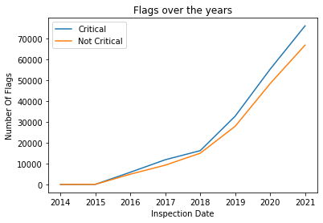
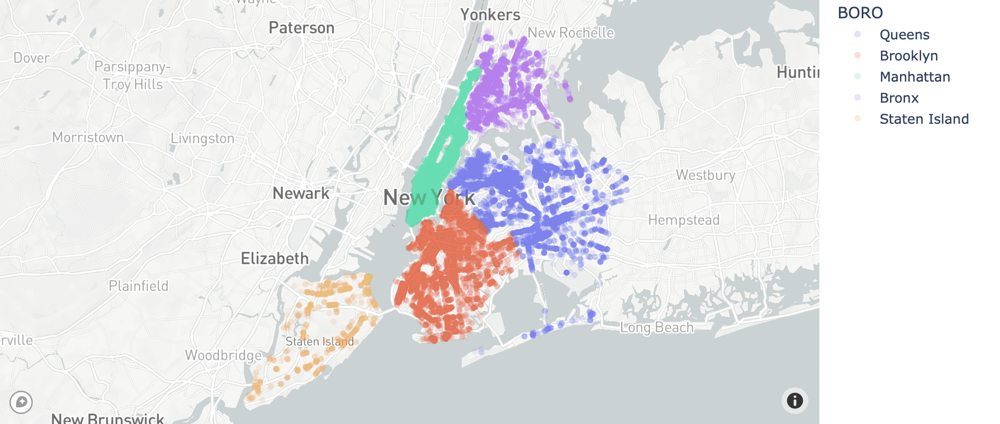

# Analyze NYC Inspections Dataset

## Abstract
The pupouse of this project is to show you what’s the most critical flag in New York City since 2014 untill 2021 followed by the highest critical
factors shown based on the outcome of the data where it will show the higher borough with critical flags. I worked with data provided by [the NYC Department of Health](https://data.cityofnewyork.us/Health/DOHMH-New-York-City-Restaurant-Inspection-Results/43nn-pn8j), 

## Design
The dataset contains every sustained or not yet adjudicated violation citation from every full or special program inspection conducted up to three years prior to the most recent inspection for restaurants and college cafeterias in an active status on the RECORD DATE. When an inspection results in more than one violation, values for associated fields are repeated for each additional violation record. Establishments are uniquely identified by their CAMIS (record ID) number.

## Data
 The dataset contains ~400,000 Boroughs with 26 features for each, 14 of which are categorical, 10 are numeric and 2 are dates. A highlights feature include  latitude/longitude coordinates.
 
## Algorithms

1. Mapping latitude and longitude to scatter mapbox
2. Converting categorical features to integers to count values of each category
3. Converting date features to string to have categorical column
4. Grouped by the boroughs to get score for each of them

<!-- *Models* -->
  

## Tools
- Pandas for data manipulation
- plotly and geopandas for mapping
- Matplotlib and Seaborn for plotting

## Visualization
- Line plot 

- Plotly Map

#### JUPYTER Link:
[JUPYTER](https://drive.google.com/drive/u/1/folders/1qk71fsVZMSg5jY8G7DyX2RpLi52ttkbg)

