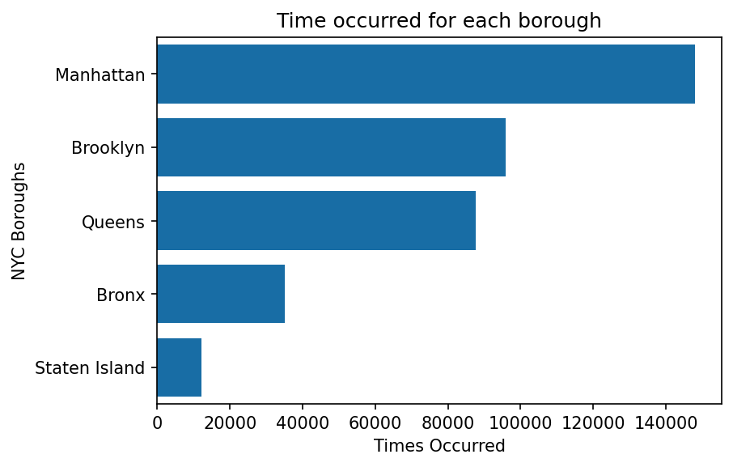

# Analysis of New York City Restaurant Inspection Results

In this analysis will show you for the past three months the most common area in NYC  got Inspected

I used a bar plot between boroughs of new york city and and the most redundent borough
and it shows that manhatten ia the first borough that gets inspected

#### JUPYTER Link:
[JUPYTER](https://drive.google.com/drive/u/1/folders/1qk71fsVZMSg5jY8G7DyX2RpLi52ttkbg)
